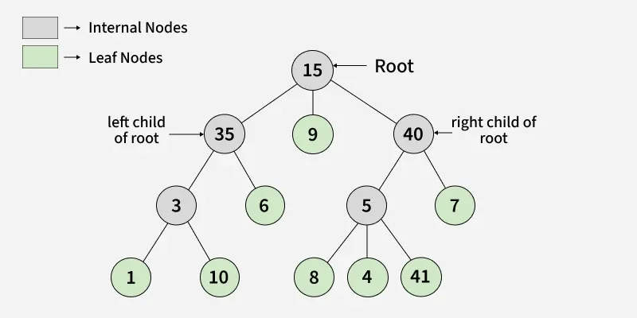

# Tree

**A Tree is a non-linear, hierarchical data structure that represents elements in a parent-child relationship. For example, in a file system, folders act as parent nodes and files or subfolders as child nodes.**

### Types of Tree

- Binary Tree : Every node has at most two children
- Ternary Tree : Every node has at most three children
- N-ary Tree : Every node has at most n children.

